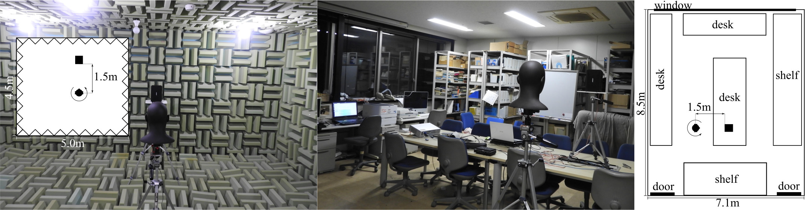

# The SAMREC Dataset

The SAMREC dataset is a set of audio recordings made with the [SAMREC Type 2500R dummy head microphones](https://shop.miyaji.co.jp/SHOP/ka-r-021716-ay04.html). 20-speech sounds were recorded in the full azimuth range, 0 elevations. The main purpose of this dataset was to allow for realistic studies of binaural sound localization with front-back discrimination capability. Recordings were made in anechoic and normal rooms. Pictures below show the rooms and its dimensions.

  

## Outline Experimental Setup

Selected 20-speech sounds from LibriSpeech ASR Corpus were used. The sounds were recorded using the SAMREC 2500R dummy head, controlled by a computer via Sound Blaster Omni Surround 5.1 sound card. The BOSE 101VM loudspeaker was placed at 1.5 m from the center of the dummy head. Reverberation time (RT60) in the normal room was around 300 ms with the average noise level of 43 dB. The level of the speech sounds observed near the pinna was 71 dB.
