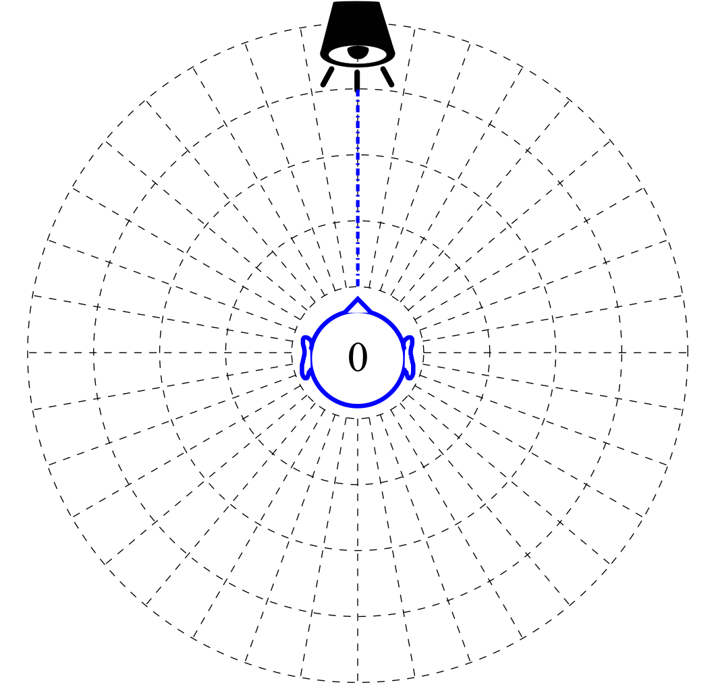

# The SAMREC Dataset

The SAMREC dataset is a set of audio recordings made with the [SAMREC Type 2500R dummy head microphones](https://shop.miyaji.co.jp/SHOP/ka-r-021716-ay04.html). 20-speech sounds were recorded in the full azimuth range, 0 elevations. The main purpose of this dataset was to allow for realistic studies of binaural sound localization with front-back discrimination capability. Recordings were made in anechoic and normal rooms of the department of Computer Science and Electrical Engineering at Kumamoto University. Pictures below show the rooms and its dimensions.

  

HRIR dataset of the SAMREC 2500R dummy-head microphones are available on the link below:

- [SAMREC 2500R HRIR Dataset](https://github.com/iru-one-syah/SAMREC-2500R-HRIR)

## Outline Experimental Setup

Selected 20-speech sounds from [LibriSpeech ASR Corpus](http://www.openslr.org/12/) were used. The sounds were recorded using the SAMREC 2500R dummy head, controlled by a computer via [Sound Blaster Omni Surround 5.1](https://us.creative.com/p/sound-blaster/sound-blaster-omni-surround-5-1) sound card. The BOSE 101VM loudspeaker was placed at 1.5 m from the center of the dummy head. [Reverberation time (RT60)](https://www.nti-audio.com/en/applications/room-building-acoustics/reverberation-time-rt60) in the normal room was around 300 ms with the average noise level of 43 dB. The level of the speech sounds observed near the pinna was 71 dB. Animation below illustrates how the recordings were made.

  

## Download Dataset

You can download the dataset from the links below:

- [(171.1 MiB) 01-Normal-Room.zip](https://docs.google.com/uc?export=download&id=1__g-Bg_--9IrA9LaxhhfEARg2SvxtXJN)
- [(165.6 MiB) 02-Anechoic-Room.zip](https://docs.google.com/uc?export=download&id=1OCBcBLshMfsrNv_6yLlUdwIVE-A5Hs4l)

## License

 This work is licensed under a <a rel="license" href="http://creativecommons.org/licenses/by/4.0/">Creative Commons Attribution 4.0 International License</a>.
